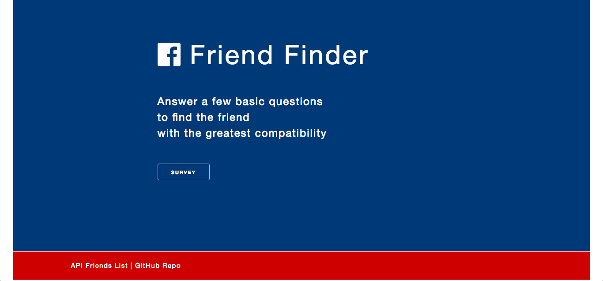
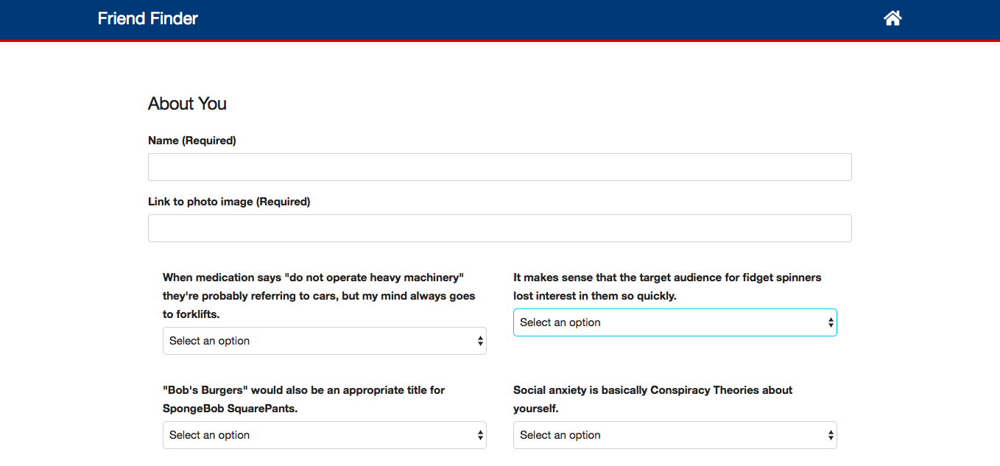
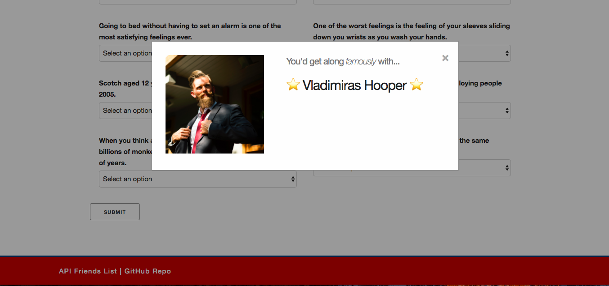

# Friend Finder
.\
.
### Idea

This is an app that asks user 10 questions in order to get a sense of their personality. This is then compared with a database of other people's answers. Whoever's answers match the user's most closely are displayed as a friend. It'd be perfectly reasonable to argue that a little discrepancy between interests is a good thing... but we'll deal with that in another app.\
.\
.
### Using the app

From the home page, you can click through to the survey. There are also links to the API friends list (JSON) and the Github repository.\
.\
.
\
.\
.\
The user must fill in their name and submits a link to a photo of themselves. They then select options (1 [strongly disagree] to 5 [strongly agree]) from the dropdown in response to the 10 questions.\
.\
.
\
.\
.\
Clicking the submit button triggers a modal that displays the result from the comparison of answers with the database. This user is then added to the database as well.\
.\
.
\
.\
.
### Technologies and Code

The app was built with HTML, CSS, Javascript and jQuery in the front end. Express and Node are the technologies facilitating the back end.

One of the more interesting challenges was matching user results to the database. It turned out to be relatively simple - giving the options a numerical score, totalling them, then finding the character whose total is closest to that which the user just posted. But I enjoyed working this out, and considering the limitations of doing it this way.\
.\
.
### UI / UX

As always I kept it relatively simple. I used the CSS framework Skeleton, which is one of my favorites. I love how slim it is, allowing me to manipulate exactly what I want to very easily. And the grid, with its built-in padding, is very comfortable to work with.

The landing page incorporates several CSS animations to give the user a slightly jazzy welcome. The survey page is more functional, with two columns of questions on the desktop, which becomes one column on mobile.

I always favor a simple color scheme, with one or two main colors and the others varying hues of these. This is probably because I'm color blind so it makes it a lot easier for me (and more empirical). But I think this kind of simplicity works well, especially for this straight-forward application.

The app is fully mobile responsive... it's 2018 -- we do personality quizzes on the go, damn it!\
.\
.
